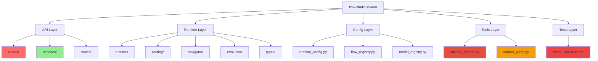

# Flow Studio Swarm - Modularization Analysis Report

**Analysis Date:** 2026-01-16  
**Analyst:** Architect Mode Analysis

---

## Executive Summary

This report identifies modularization opportunities and areas needing rework in the flow-studio-swarm repository. The analysis reveals significant improvements have been made since the outdated report (e.g., API routes reduced from 2038 lines to 139 lines), but several critical monolithic files remain that require immediate attention.

---

## HIGH PRIORITY Issues

### 1. Massive Monolithic Validation Tool
**File:** [`swarm/tools/validate_swarm.py`](swarm/tools/validate_swarm.py:1)  
**Line Count:** 3090 lines  
**Issue:** Absolutely massive monolithic file containing multiple validation functions, CLI argument parsing, output formatting, and report generation.

**Specific Issues:**
- Contains ValidatorRunner class orchestrating 15+ validation checks
- Multiple validation functions in single file (validate_bijection, validate_frontmatter, validate_colors, validate_flow_references, validate_skills, validate_runbase_paths, validate_prompt_sections, validate_no_empty_flows, validate_flow_agent_validity, validate_flow_documentation_completeness, validate_flow_studio_sync, validate_utility_flow_graphs, validate_microloop_phrases, validate_capability_registry)
- Helper functions: parse_agents_registry, parse_config_files, levenshtein_distance, suggest_typos, parse_flow_spec_agents, parse_flow_config
- Output functions: build_detailed_json_output, build_report_markdown
- CLI with argparse and multiple flags (--check-modified, --check-prompts, --strict, --debug, --json, --report, --version)

**Recommendation:**
Split into focused modules:
- `swarm/tools/validators/` - Individual validator modules
- `swarm/tools/validation/` - Core validation framework
- `swarm/tools/validation/reporting.py` - Output formatting
- `swarm/tools/validation/cli.py` - CLI interface
- `swarm/tools/validation/helpers.py` - Shared utilities

---

### 2. Monolithic Router with Multiple Responsibilities
**File:** [`swarm/runtime/router.py`](swarm/runtime/router.py:1)  
**Line Count:** 1847 lines  
**Issue:** Contains multiple classes and concerns that should be separated.

**Specific Issues:**
- Contains DecisionType, ConditionEval, RouteDecision, StepOutput, RouteContext, EdgeCondition, NodeConfig classes (type definitions)
- Contains CELEvaluator class for CEL expression evaluation
- Contains FlowGraph class for graph operations
- Contains SmartRouter class (graph-constrained router with LLM tie-breaker)
- Contains StepRouter class (WP4-compliant bounded, auditable, cheap router)
- Contains RoutingResult and RunContext dataclasses
- Contains functions: route_from_step, attach_routing_audit, convert_to_wp4_explanation

**Recommendation:**
Split into focused modules:
- `swarm/runtime/routing/types.py` - Type definitions
- `swarm/runtime/routing/cel_evaluator.py` - CEL evaluation
- `swarm/runtime/routing/flow_graph.py` - Graph operations
- `swarm/runtime/routing/smart_router.py` - Smart router
- `swarm/runtime/routing/step_router.py` - Step router
- `swarm/runtime/routing/conversion.py` - WP4 conversion utilities
- `swarm/runtime/routing/route_from_step.py` - Main routing function

---

### 3. Monolithic Autopilot Controller
**File:** [`swarm/runtime/autopilot.py`](swarm/runtime/autopilot.py:1)  
**Line Count:** 1501 lines  
**Issue:** Large controller class with evolution processing mixed in.

**Specific Issues:**
- Contains AutopilotStatus, EvolutionApplyPolicy, EvolutionBoundary enums
- Contains EvolutionSuggestion, AutopilotConfig, WisdomApplyResult, AutopilotResult, AutopilotState dataclasses
- Contains AutopilotController class with methods: start, tick, run_to_completion, cancel, stop, pause, resume
- Contains evolution processing logic (_process_evolution_at_boundary, _process_evolution_at_flow_end, _apply_evolution_suggestions)

**Recommendation:**
Extract evolution processing to dedicated module:
- `swarm/runtime/autopilot/evolution_processor.py` - Evolution processing logic
- Keep AutopilotController focused on orchestration lifecycle

---

### 4. Business Logic in Route Files
**File:** [`swarm/api/routes/runs_control.py`](swarm/api/routes/runs_control.py:1)  
**Line Count:** 795 lines  
**Issue:** Business logic mixed with HTTP handling.

**Specific Issues:**
- Contains pause, resume, inject, interrupt, cancel, and stop endpoints
- Contains private `_write_stop_report` function (lines 692-795) with business logic for writing stop reports
- Mixed concerns: HTTP request/response handling mixed with run state management logic

**Recommendation:**
Extract business logic to service layer:
- Create `swarm/api/services/run_control_service.py` for pause/resume/inject/interrupt/cancel/stop logic
- Keep routes focused on HTTP request/response handling only

---

### 5. Tests in Root Directory
**Location:** [`tests/`](tests/)  
**Issue:** All test files in root directory without subdirectory organization.

**Specific Issues:**
- 100+ test files in flat structure
- Difficult to find related tests
- No clear categorization (unit, integration, e2e, contract, etc.)
- Only `tests/bdd/` and `tests/contract/` subdirectories exist

**Recommendation:**
Organize tests by category:
- `tests/unit/` - Unit tests
- `tests/integration/` - Integration tests
- `tests/e2e/` - End-to-end tests
- `tests/contract/` - Contract tests
- `tests/bdd/` - BDD tests (existing)
- `tests/api/` - API-specific tests
- `tests/runtime/` - Runtime-specific tests
- `tests/tools/` - Tools-specific tests

---

## MEDIUM PRIORITY Issues

### 1. Large Navigator File
**File:** [`swarm/runtime/navigator.py`](swarm/runtime/navigator.py:1)  
**Line Count:** 1147 lines  
**Issue:** Large file combining Navigator pattern, ProgressTracker, and prompt building.

**Specific Issues:**
- Contains RouteIntent, SignalLevel enums
- Contains EdgeCandidate, SidequestOption, VerificationSummary, FileChangesSummary, StallSignals dataclasses
- Contains ProposedNode, ProposedEdge, NavigatorInput, RouteProposal, DetourRequest, UtilityFlowRequest dataclasses
- Contains NavigatorSignals, NextStepBrief dataclasses
- Contains NavigatorOutput dataclass
- Contains ProgressTracker class (traditional tooling for stall detection)
- Contains Navigator class (LLM intelligence)
- Contains functions: build_navigator_input, extract_candidate_edges_from_graph

**Recommendation:**
Split into focused modules:
- `swarm/runtime/navigator/types.py` - Type definitions
- `swarm/runtime/navigator/progress_tracker.py` - Progress tracking
- `swarm/runtime/navigator/navigator.py` - Navigator class
- `swarm/runtime/navigator/input_builder.py` - Input building utilities

---

### 2. Large Forensic Types File
**File:** [`swarm/runtime/forensic_types.py`](swarm/runtime/forensic_types.py:1)  
**Line Count:** 1417 lines  
**Issue:** Large file with multiple type definitions and utility functions.

**Specific Issues:**
- Contains MarkerType, ScanType, VerificationStatus, FailureType, TestFramework, StallType, RecommendedAction enums
- Contains ScanSource, TestFailure, ModeChange dataclasses
- Contains ForensicMarker, DiffScanResult, TestParseResult, ScanMetadata dataclasses
- Contains GitState, StateSnapshot, ArtifactChange dataclasses
- Contains ProgressDelta, ForensicBinding, StallAnalysis, IterationContext dataclasses
- Contains ProgressEvidenceMetadata, ProgressEvidence dataclasses
- Contains utility functions: compute_stall_indicator, compute_evidence_hash, compute_delta, generate_evidence_id, generate_marker_id

**Recommendation:**
Split into focused modules:
- `swarm/runtime/forensics/types.py` - Type definitions
- `swarm/runtime/forensics/verification_types.py` - Verification types (markers, scans, test results)
- `swarm/runtime/forensics/progress_types.py` - Progress types (snapshots, deltas, evidence)
- `swarm/runtime/forensics/computations.py` - Utility functions

---

### 3. Autopilot Routes with Business Logic
**File:** [`swarm/api/routes/autopilot_routes.py`](swarm/api/routes/autopilot_routes.py:1)  
**Line Count:** 470 lines  
**Issue:** Contains Pydantic models and controller getter mixed with route definitions.

**Specific Issues:**
- Contains AutopilotStatus enum
- Contains AutopilotStartRequest, AutopilotTickRequest, AutopilotStatusResponse dataclasses
- Contains get_autopilot_controller function
- Contains route definitions

**Recommendation:**
Extract models to dedicated module:
- `swarm/api/models/autopilot_models.py` - Autopilot-specific models
- Keep routes focused on HTTP endpoints

---

### 4. Evolution Files with Overlapping Responsibilities
**Files:** 
- [`swarm/runtime/evolution.py`](swarm/runtime/evolution.py:1) (977 lines)
- [`swarm/runtime/evolution_processor.py`](swarm/runtime/evolution_processor.py:1) (741 lines)

**Issue:** Two files handling evolution with some overlap in responsibilities.

**Specific Issues:**
- Both contain evolution-related types and processing logic
- evolution.py contains patch generation, validation, and application
- evolution_processor.py contains policy-gated processing
- Some duplication in type definitions

**Recommendation:**
Clarify separation of concerns:
- Keep evolution.py for patch generation and application (file operations)
- Keep evolution_processor.py for orchestration and policy enforcement
- Extract shared types to `swarm/runtime/evolution/types.py`

---

### 5. Large Types File
**File:** [`swarm/runtime/types/__init__.py`](swarm/runtime/types/__init__.py:1)  
**Line Count:** 1530+ lines  
**Issue:** All type definitions in single file.

**Specific Issues:**
- Contains RunStatus, SDLCStatus, RunSpec, RunSummary, RunEvent enums
- Contains BackendCapabilities, InterruptionFrame, ResumePoint, InjectedNodeSpec dataclasses
- Contains RunState, MacroAction, GateVerdict, FlowOutcome dataclasses
- Contains MacroRoutingRule, MacroPolicy, HumanPolicy dataclasses
- Contains RunPlanSpec, MacroRoutingDecision dataclasses
- Contains RoutingDecision, RoutingMode, SkipJustification, WhyNowJustification dataclasses
- Contains RoutingFactor, LLMReasoning, CELEvaluation, MicroloopContext dataclasses
- Contains DecisionMetrics, StallContext, WP4EliminationEntry dataclasses
- Contains WP4RoutingMetrics, WP4RoutingExplanation, RoutingExplanation dataclasses
- Contains RoutingCandidate dataclass

**Recommendation:**
Split by domain:
- `swarm/runtime/types/run_types.py` - Run-related types
- `swarm/runtime/types/routing_types.py` - Routing-related types
- `swarm/runtime/types/macro_types.py` - Macro-related types
- `swarm/runtime/types/interruption_types.py` - Interruption-related types

---

### 6. Large Runtime Config File
**File:** [`swarm/config/runtime_config.py`](swarm/config/runtime_config.py:1)  
**Line Count:** 726 lines  
**Issue:** Configuration, context budget resolution, and provider/engine configuration mixed in one file.

**Specific Issues:**
- Contains ContextBudgetConfig dataclass
- Contains ContextBudgetResolver class with cascade resolution logic
- Multiple functions for engine mode, execution mode, CLI path, defaults, features
- Context budget validation and clamping logic
- Provider and engine configuration helpers

**Recommendation:**
Split by concern:
- `swarm/config/runtime_config/budget.py` - Context budget resolution
- `swarm/config/runtime_config/engine.py` - Engine configuration
- `swarm/config/runtime_config/providers.py` - Provider configuration
- `swarm/config/runtime_config/features.py` - Feature flags

---

## LOW PRIORITY Issues

### 1. Code Duplication in Routing Helpers
**Files:** 
- [`swarm/runtime/routing_helpers.py`](swarm/runtime/routing_helpers.py:1) (447 lines)
- [`swarm/runtime/routing_utils.py`](swarm/runtime/routing_utils.py:1) (114 lines)

**Issue:** Some overlap in routing decision handling.

**Specific Issues:**
- routing_helpers.py contains MicroloopState and should_exit_microloop for microloop termination
- routing_utils.py contains parse_routing_decision for decision string parsing
- Both provide single source of truth for routing logic (good pattern)

**Recommendation:**
These files are well-designed and should be preserved. Consider consolidating similar utility functions.

---

### 2. Missing Service Layers
**Issue:** Some business logic still in route files.

**Specific Issues:**
- Run control logic in [`runs_control.py`](swarm/api/routes/runs_control.py:1)
- Autopilot controller getter in [`autopilot_routes.py`](swarm/api/routes/autopilot_routes.py:1)

**Recommendation:**
Create service layers:
- `swarm/api/services/run_control_service.py` - For run control operations
- `swarm/api/services/autopilot_service.py` - For autopilot operations

---

### 3. Inconsistent Type Definitions
**Issue:** Type definitions scattered across multiple files.

**Specific Issues:**
- Some types in [`swarm/runtime/types/__init__.py`](swarm/runtime/types/__init__.py:1)
- Some types in domain-specific files (e.g., routing_helpers.py, navigator.py)
- Potential for confusion about where to find type definitions

**Recommendation:**
Establish clear type hierarchy:
- Keep domain-specific types with their modules
- Keep cross-domain types in central types module
- Document type organization in module docstrings

---

### 4. Large Flow Registry File
**File:** [`swarm/config/flow_registry.py`](swarm/config/flow_registry.py:1)  
**Line Count:** 412 lines  
**Issue:** Flow registry with teaching notes and routing configuration.

**Specific Issues:**
- Contains TeachingNotes, StepRouting, ContextBudgetOverride, EngineProfile dataclasses
- Contains StepDefinition, FlowDefinition dataclasses
- Contains FlowRegistry class with flow loading and indexing
- Some overlap with routing configuration

**Recommendation:**
Consider splitting:
- `swarm/config/flow_registry/types.py` - Type definitions
- `swarm/config/flow_registry/loader.py` - Flow loading logic
- `swarm/config/flow_registry/indexing.py` - Flow indexing and agent lookup

---

## STRENGTHS AND GOOD PATTERNS

### 1. API Route Aggregation Pattern
**File:** [`swarm/api/routes/runs.py`](swarm/api/routes/runs.py:1) (139 lines)

**Strength:** Excellent use of route aggregation pattern.

**Details:**
- Clean separation of concerns with sub-routers (runs_crud, runs_control, runs_stack, autopilot_routes)
- Explicit prefixes for each sub-router
- Re-exports for backward compatibility
- Well-documented with clear purpose

---

### 2. Service Layer Extraction
**File:** [`swarm/api/services/run_state.py`](swarm/api/services/run_state.py:1) (186 lines)

**Strength:** Good service layer pattern for run state management.

**Details:**
- RunStateManager class with in-memory cache and disk persistence
- ETag-based concurrency control
- Clear separation from HTTP handling
- Well-structured with create_run, get_run, update_run, list_runs methods

---

### 3. Single Source of Truth Patterns
**Files:**
- [`swarm/runtime/routing_helpers.py`](swarm/runtime/routing_helpers.py:1) - Microloop exit logic
- [`swarm/runtime/routing_utils.py`](swarm/runtime/routing_utils.py:1) - Routing decision parsing

**Strength:** Centralized decision logic with clear contracts.

**Details:**
- MicroloopState dataclass with well-documented methods
- should_exit_microloop function with clear priority order
- Comprehensive docstrings with examples
- Canonical mapping for routing decisions

---

### 4. Configuration Management
**Files:**
- [`swarm/config/runtime_config.py`](swarm/config/runtime_config.py:1) (726 lines)
- [`swarm/config/flow_registry.py`](swarm/config/flow_registry.py:1) (412 lines)
- [`swarm/config/model_registry.py`](swarm/config/model_registry.py:1) (420 lines)

**Strength:** Well-organized configuration system.

**Details:**
- Clear separation of concerns (runtime, flows, models)
- Environment variable precedence handling
- Context budget cascade resolution with guardrails
- Model policy system with tier aliases

---

### 5. Orchestrator Modularization
**File:** [`swarm/runtime/orchestrator.py`](swarm/runtime/orchestrator.py:1) (30 lines)

**Strength:** Backward compatibility shim indicating modularization has occurred.

**Details:**
- Re-exports from swarm.runtime.stepwise package
- Clear documentation of modularization
- Preserves existing API while enabling new structure

---

### 6. Well-Organized Config Directory
**Directory:** [`swarm/config/`](swarm/config/)

**Strength:** Good separation of configuration files.

**Details:**
- Separate files for flows, models, agents, tours
- YAML-based configuration with clear structure
- README files for documentation

---

### 7. Good Type Documentation
**Files:** Multiple runtime files with comprehensive docstrings.

**Strength:** Extensive documentation with examples.

**Details:**
- Detailed docstrings explaining purpose, usage, and examples
- Type hints throughout
- Clear separation of concerns in documentation

---

### 8. Protocol-Based Design
**File:** [`swarm/runtime/evolution_processor.py`](swarm/runtime/evolution_processor.py:1)

**Strength:** EventEmitter protocol for testability.

**Details:**
- EventEmitter protocol for emitting evolution events
- StorageEventEmitter implementation using storage module
- NoOpEmitter fallback for testing without storage
- Enables isolated testing of evolution processor

---

## RECOMMENDED REFACTORING APPROACH

### Phase 1: Critical Monolithic Files (High Priority)

1. **Split validate_swarm.py** into focused modules
2. **Split router.py** into routing subsystem
3. **Split autopilot.py** - extract evolution processing
4. **Extract business logic from runs_control.py** to service layer
5. **Organize tests** into subdirectories

### Phase 2: Type System Cleanup (Medium Priority)

1. **Split types/__init__.py** by domain
2. **Clarify type definition locations**
3. **Consolidate evolution types**

### Phase 3: Service Layer Expansion (Medium Priority)

1. **Create run_control_service.py**
2. **Create autopilot_service.py**
3. **Extract additional service opportunities**

### Phase 4: Code Quality Improvements (Low Priority)

1. **Consolidate routing utilities**
2. **Improve type documentation**
3. **Add missing abstractions**

---

## ARCHITECTURE DIAGRAM

---

## SUMMARY STATISTICS

| Category | Files Analyzed | Issues Found |
|----------|---------------|--------------|
| Monolithic Files (>500 lines) | 10 |
| Code Duplication | 3 areas |
| Mixed Concerns | 2 areas |
| Missing Service Layers | 2 areas |
| Test Organization | 1 area |
| Strengths Identified | 8 patterns |

**Total Actionable Recommendations:** 27

---

## NEXT STEPS

1. Review this analysis report
2. Prioritize refactoring based on team capacity
3. Begin with High Priority items (validate_swarm.py, router.py, autopilot.py)
4. Create service layers for business logic extraction
5. Organize tests by category
6. Continue with Medium Priority items (type system, navigator, etc.)
7. Address Low Priority items incrementally

---

**Report Generated:** 2026-01-16
**Analysis Scope:** swarm/api/, swarm/runtime/, swarm/tools/, swarm/config/, tests/
