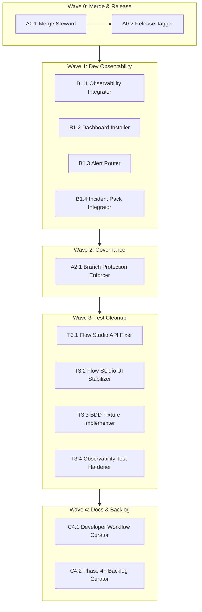

# Flow: Selftest Phase 3 — Rollout & Hardening

**Goal:** Complete Phase 2 merge, cut v2.0.0 release, integrate observability in dev, enforce governance gates, fix outstanding test xfails, and document Phase 4+ backlog.

**Question:** Is the selftest system operationally ready for developer use?

**Core Outputs:** `v2.0.0` release tag, dev observability integration, governance gate enforcement, test suite fully green

---

## Artifact Paths

For this flow, outputs are primarily:

- Git artifacts: PR merge, release tag (`v2.0.0`)
- Infrastructure: observability backends, dashboards, alerts
- Tests: un-xfailed test files in `tests/`
- Docs: updated `CHANGELOG.md`, incident tooling references

No `RUN_BASE` artifacts—this is an operationalization flow, not a feature flow.

---

## Upstream Inputs

This flow reads from Phase 2 completion:

- `PHASE_2_COMPLETION_SUMMARY.md` — what was built
- `PHASE_3_TASKS.md` — work breakdown
- PR #3 — pending merge
- CI status — must be green
- `selftest_metrics.jsonl` — current metrics state

---

## Orchestration Model

Phase 3 is a **5-wave linear rollout** with parallelism within waves.

### Execution Levels

1. **Orchestrator (human or top-level Claude)**:
   - Sequences waves (Wave 0 before Wave 1, etc.)
   - Launches agents within each wave (parallel where noted)
   - Gates wave completion before proceeding

2. **Agents (13 specialized roles)**:
   - Each agent has a single responsibility
   - Outputs: commands run, artifacts produced, "Done when" criteria
   - No inter-agent dependencies within a wave (parallel-safe)

---

## Agents (13 specialized roles)

| Agent ID | Wave | Category | Responsibility |
|----------|------|----------|----------------|
| A0.1 | 0 | merge | Merge Steward — safely land PR #3 on `main` |
| A0.2 | 0 | release | Release Tagger — cut `v2.0.0` tag |
| B1.1 | 1 | observability | Dev Observability Integrator — enable metrics in dev |
| B1.2 | 1 | observability | Dashboard Installer — import dashboards/SLOs |
| B1.3 | 1 | observability | Alert Router — wire alerts to channels |
| B1.4 | 1 | observability | Incident Pack Integrator — add tooling to runbooks |
| A2.1 | 2 | governance | Branch Protection Enforcer — require governance gate |
| T3.1 | 3 | testing | Flow Studio API Fixer — un-xfail governance tests |
| T3.2 | 3 | testing | Flow Studio UI Stabilizer — fix status banner test |
| T3.3 | 3 | testing | BDD Fixture Implementer — implement missing steps |
| T3.4 | 3 | testing | Observability Test Hardener — fix backend tests |
| C4.1 | 4 | docs | Developer Workflow Curator — document selftest path |
| C4.2 | 4 | docs | Phase 4+ Backlog Curator — capture future work |

---

## Flow Structure



---

## Steps

| # | Step | Agents | Role |
|---|------|--------|------|
| 0.1 | `merge` | A0.1 Merge Steward | Validate CI, merge PR #3, confirm `main` green |
| 0.2 | `tag` | A0.2 Release Tagger | Update CHANGELOG, tag `v2.0.0`, push |
| 1.1 | `obs-integrate` | B1.1 Dev Observability Integrator | Configure backends, deploy, verify metrics |
| 1.2 | `dashboard` | B1.2 Dashboard Installer | Import Grafana dashboard, apply SLOs |
| 1.3 | `alerts` | B1.3 Alert Router | Wire alerts to dev channels, test firing |
| 1.4 | `incident-tools` | B1.4 Incident Pack Integrator | Update runbooks with selftest tooling |
| 2.1 | `branch-protect` | A2.1 Branch Protection Enforcer | Enable required status checks on `main` |
| 3.1 | `fix-api-tests` | T3.1 Flow Studio API Fixer | Un-xfail governance API tests |
| 3.2 | `fix-ui-tests` | T3.2 Flow Studio UI Stabilizer | Un-xfail status banner test |
| 3.3 | `fix-bdd` | T3.3 BDD Fixture Implementer | Implement missing BDD steps |
| 3.4 | `fix-obs-tests` | T3.4 Observability Test Hardener | Fix or document backend tests |
| 4.1 | `workflow-docs` | C4.1 Developer Workflow Curator | Document selftest developer path |
| 4.2 | `backlog` | C4.2 Phase 4+ Backlog Curator | Create Phase 4+ task list |

---

## Wave 0 — Merge & Release (P3.1–P3.2)

### A0.1 Merge Steward

**Goal:** Safely land Phase 2 on `main`.

**Context:**
- Branch: `feat/selftest-resilience-slice-1`
- PR: #3
- Upstream: CI must be green

**Commands:**
```bash
# On feat/selftest-resilience-slice-1
make dev-check
uv run pytest tests/ -v
uv run swarm/tools/validate_swarm.py

# Sanity checks before merge:
# - No secrets in observability/alerts/channels.yaml
# - No local paths (~/...) in tests

# Merge via GitHub UI or:
gh pr merge 3 --merge
```

**Done when:**
- PR #3 merged to `main`
- `main` CI is green
- `git log main` shows Phase 2 commits

---

### A0.2 Release Tagger

**Goal:** Cut `v2.0.0` as the "Observability Release".

**Context:**
- Branch: `main` (after merge)
- Files: `CHANGELOG.md`, `PHASE_2_COMPLETION_SUMMARY.md`

**Commands:**
```bash
git checkout main
git pull origin main
make dev-check
uv run pytest tests/ -v

# Update CHANGELOG.md with v2.0.0 entry:
# - Observability stack (metrics, dashboards, SLOs, alerts)
# - Remediation suggestions
# - CI governance gate

git add CHANGELOG.md
git commit -m "docs: add v2.0.0 changelog entry"
git tag -a v2.0.0 -m "Selftest Phase 2: Observability & Remediation"
git push origin main
git push origin v2.0.0
```

**Done when:**
- Tag `v2.0.0` exists on remote
- `git tag -l` shows `v2.0.0`
- CHANGELOG has v2.0.0 section

---

## Wave 1 — Dev Observability & Alerts (P3.3–P3.5, P3.9)

### B1.1 Dev Observability Integrator

**Goal:** Enable metrics emission in dev environment.

**Context:**
- Files:
  - `swarm/config/observability_backends.yaml`
  - `swarm/config/README_OBSERVABILITY.md`
  - `swarm/tools/selftest_metrics.py`

**Commands:**
```bash
# Configure observability_backends.yaml for dev:
# - primary: prometheus or jsonl_logs
# - Set minimal viable config

# Deploy main@v2.0.0 to dev environment

# Verify in dev:
make selftest-fast
make selftest-govern

# Check metrics via Prometheus UI or logs
```

**Done when:**
- At least one selftest run in dev emits metrics
- No runtime errors when backends misconfigured/disabled
- `selftest_metrics.jsonl` shows new entries (if JSONL backend)

---

### B1.2 Dashboard Installer

**Goal:** Install selftest dashboards and SLOs in dev.

**Context:**
- Files:
  - `observability/dashboards/selftest_dashboard.json`
  - `observability/dashboards/selftest_dashboard.jsonnet` (optional)
  - `observability/slos/selftest_slos.yaml`
  - `docs/SELFTEST_OBSERVABILITY_SPEC.md`

**Commands:**
```bash
# Import dashboard into Grafana:
# - Upload selftest_dashboard.json via Grafana UI
# - Or use grafana-cli / API

# Apply SLOs:
# - Import selftest_slos.yaml into SLO system

# Run selftest a few times (pass + forced degradation):
make selftest
SELFTEST_FORCE_DEGRADED=1 make selftest

# Verify dashboard shows:
# - Run counts
# - Failure/degradation rates
# - Step durations
```

**Done when:**
- "Selftest" dashboard visible in Grafana (or equivalent)
- Dashboard updates when selftest runs
- SLOs appear in monitoring system with sane status

---

### B1.3 Alert Router

**Goal:** Wire selftest alerts to real dev/stage channels.

**Context:**
- Files:
  - `observability/alerts/selftest_alerts.yaml`
  - `observability/alerts/channels.yaml`
  - `observability/alerts/README.md`

**Commands:**
```bash
# Map alerts in channels.yaml:
# - kernel_failure → PagerDuty/critical channel
# - governance_degraded → Slack/ticket channel

# Apply alert configs via infra-as-code or UI

# Test in dev:
# Trigger kernel failure:
SELFTEST_INJECT_KERNEL_FAIL=1 make selftest

# Trigger governance degradation:
SELFTEST_INJECT_GOVERNANCE_FAIL=1 make selftest

# Verify:
# - Kernel → page/critical alert
# - Governance → Slack/ticket, not a page
# - Alert body contains: step_id, tier, message, remediation
```

**Done when:**
- Kernel alert fires once and lands in critical channel
- Governance alert fires once and lands in ticket channel
- Alert bodies contain structured metadata

---

### B1.4 Incident Pack Integrator

**Goal:** Make selftest incident tooling part of on-call playbook.

**Context:**
- Files:
  - `Makefile` (selftest-incident-pack, selftest-suggest-remediation)
  - `docs/OPERATOR_CHECKLIST.md`
  - `docs/SELFTEST_ENVIRONMENT_OPERATIONS.md`

**Commands:**
```bash
# Verify in dev:
make selftest-incident-pack
make selftest-suggest-remediation

# Inspect incident pack contents:
# - selftest_degradations.log (if present)
# - /platform/status output
# - /api/selftest/plan output

# Update incident/runbook docs:
# - Add "Run make selftest-incident-pack" as standard step
# - Add "Use make selftest-suggest-remediation for hints" as optional
```

**Done when:**
- Incident pack generates successfully
- Pack is small enough to attach, rich enough to diagnose
- Runbook/on-call docs reference selftest tools

---

## Wave 2 — Governance & Branch Protection (P3.6)

### A2.1 Branch Protection Enforcer

**Goal:** Make governance gate a required check on `main`.

**Context:**
- GitHub repo: `EffortlessMetrics/flow-studio`
- Workflow: `.github/workflows/selftest-governance-gate.yml`
- Docs: `docs/BRANCH_PROTECTION_SETUP.md`

**Commands:**
```bash
# In GitHub Settings → Branches → main:
# - Add "Selftest Governance Gate" as required status check

# Test enforcement:
# 1. Create test PR that breaks an AC or selftest contract
# 2. Confirm governance gate goes red
# 3. Confirm error output links to docs/commands

# Update docs/BRANCH_PROTECTION_SETUP.md:
# - "Gate is now required on main from v2.0.0 onwards"
```

**Done when:**
- Cannot merge to `main` without governance gate passing
- Test PR with broken AC is blocked
- `docs/BRANCH_PROTECTION_SETUP.md` reflects configuration

---

## Wave 3 — Test Cleanup & Un-Xfail (P3.7)

### T3.1 Flow Studio API Fixer

**Goal:** Turn Flow Studio governance API tests from `xfail` to pass.

**Context:**
- Files:
  - `tests/test_flow_studio_governance.py`
  - `swarm/tools/flow_studio.py`
  - `swarm/tools/flow_studio_fastapi.py`
  - Flow configs: `swarm/flows/flow-*.md`

**Commands:**
```bash
# For each @pytest.mark.xfail in test_flow_studio_governance.py:

# 1. Ensure Flow Studio loads flows from test fixtures
# 2. Stabilize API responses:
#    - /api/health
#    - /api/flows
#    - /api/flows/<flow>
#    - /api/graph/<flow>
#    - /api/agents/<agent>/usage
#    - /api/tours

# 3. Remove xfail once test passes:
uv run pytest tests/test_flow_studio_governance.py -v

# 4. Verify in CI:
# Tests must not depend on local-only paths
```

**Done when:**
- All Flow Studio governance tests pass without `xfail`
- CI runs `tests/test_flow_studio_governance.py` green

---

### T3.2 Flow Studio UI Stabilizer

**Goal:** Fix `TestFlowStudioSelftestUI::test_status_banner_reflects_api`.

**Context:**
- Files:
  - `tests/test_flow_studio_selftest_ui_integration.py`
  - UI/frontend stubs
  - Selftest API: `/platform/status`, `/api/selftest/plan`

**Commands:**
```bash
# 1. Provide deterministic fake /platform/status responses in tests
# 2. Ensure banner component reads data correctly in test harness
# 3. Remove xfail:

uv run pytest tests/test_flow_studio_selftest_ui_integration.py -v

# 4. Verify stability across multiple CI runs
```

**Done when:**
- UI integration test passes reliably
- No intermittent failures in CI

---

### T3.3 BDD Fixture Implementer

**Goal:** Implement missing BDD fixtures and un-skip scenarios.

**Context:**
- Files:
  - `features/selftest.feature`
  - `tests/test_selftest_bdd.py`
  - `conftest.py` (shared fixtures)

**Commands:**
```bash
# For each skipped scenario in test_selftest_bdd.py:

# 1. Implement missing step fixtures/definitions
# 2. Ensure steps run against real selftest or realistic stub
# 3. Replace @pytest.mark.skip with:
#    - Normal test (if implemented), or
#    - xfail with clear reason and P4+ ticket (if partial)

uv run pytest tests/test_selftest_bdd.py -v

# Verify no "unexpected" skips due to missing fixtures
```

**Done when:**
- All BDD scenarios pass or are explicit `xfail` with P4+ ticket
- No missing fixture errors

---

### T3.4 Observability Test Hardener

**Goal:** Fix or clearly document `xfail` in observability backend tests.

**Context:**
- Files:
  - `tests/test_observability_backends.py`
  - `swarm/tools/selftest_metrics.py`
  - `swarm/config/observability_backends.yaml`

**Commands:**
```bash
# Analyze test_backend_manager_strict_mode_raises_on_init_failure:
# - Is the assumption about Prometheus/port validation correct?

# If yes:
# - Adjust backend manager behavior
# - Remove xfail

# If no:
# - Tighten test to assert realistic behavior
# - Keep xfail with P4+ note

uv run pytest tests/test_observability_backends.py -v

# Document actual strict mode semantics
```

**Done when:**
- Observability tests green or `xfail` with clear P4+ justification
- Docs reflect actual strict mode behavior

---

## Wave 4 — Developer Workflow & Backlog (P3.8–P3.10)

### C4.1 Developer Workflow Curator

**Goal:** Make selftest flow the default developer path.

**Context:**
- Files:
  - `docs/SELFTEST_DEVELOPER_WORKFLOW.md`
  - `README.md`
  - `docs/INDEX.md`
  - `.pre-commit-config.yaml`

**Commands:**
```bash
# Ensure README and INDEX highlight:
# - make selftest-fast
# - make selftest-govern
# - make selftest
# - make selftest-suggest-remediation
# - make selftest-incident-pack

# Validate pre-commit hooks:
# - Only run on relevant file changes
# - Fast enough to not annoy developers
# - Error messages point to docs/commands

# Draft 1-2 page "How to use selftest" note using existing docs
```

**Done when:**
- New dev can read one doc section, run 3-4 commands, understand failures
- Pre-commit hooks are fast and informative

---

### C4.2 Phase 4+ Backlog Curator

**Goal:** Capture post-P3 work explicitly.

**Context:**
- Files:
  - `PHASE_3_TASKS.md`
  - `PHASE_2_COMPLETION_SUMMARY.md`

**Commands:**
```bash
# Extract "later" items:
# - Auto-remediation executor (approval-gated)
# - Distributed/parallel selftest execution
# - Runbook automation (auto-trigger selftest on alerts)
# - Pattern extraction for other repos (template, shared CLI)

# Create PHASE_4_TASKS.md or add "Future Work" section to PHASE_3_TASKS.md:
# - P4.1 Auto-remediation executor
# - P4.2 Distributed selftest
# - P4.3 Runbook automation
# - P4.4 Cross-repo template
```

**Done when:**
- Phase 4+ backlog exists with IDs and dependencies
- References current state (v2.0.0)
- Doesn't block current work

---

## Completion Criteria

Phase 3 is **complete** when:

1. **Wave 0:** `v2.0.0` tag exists on `main`, CI green
2. **Wave 1:** Selftest metrics visible in dev, dashboards/SLOs/alerts working
3. **Wave 2:** Governance gate required on `main`, enforcement tested
4. **Wave 3:** All tests pass without `xfail` (or explicit P4+ deferrals)
5. **Wave 4:** Developer docs updated, Phase 4+ backlog captured

---

## Notes

- **Sequential waves**: Wave N must complete before Wave N+1 starts
- **Parallel within waves**: Agents in same wave can run concurrently
- **Human gates**: Each wave completion is a checkpoint for review
- **Rerun semantics**: Individual agents can be re-run if their "Done when" not met
- **No blocking**: If an agent can't complete, document status and continue
- **P4+ deferrals**: Test xfails that can't be fixed go to P4 backlog, not blocked

---

## Extension Points

To customize this flow:

1. **Add Wave 1.5 for staging**: Copy Wave 1 agents for staging environment
2. **Add Wave 2.5 for multi-branch**: Extend branch protection to `release/*`
3. **Add Wave 5 for production**: Full production observability integration
4. **Add regression testing**: Run full e2e after each wave
